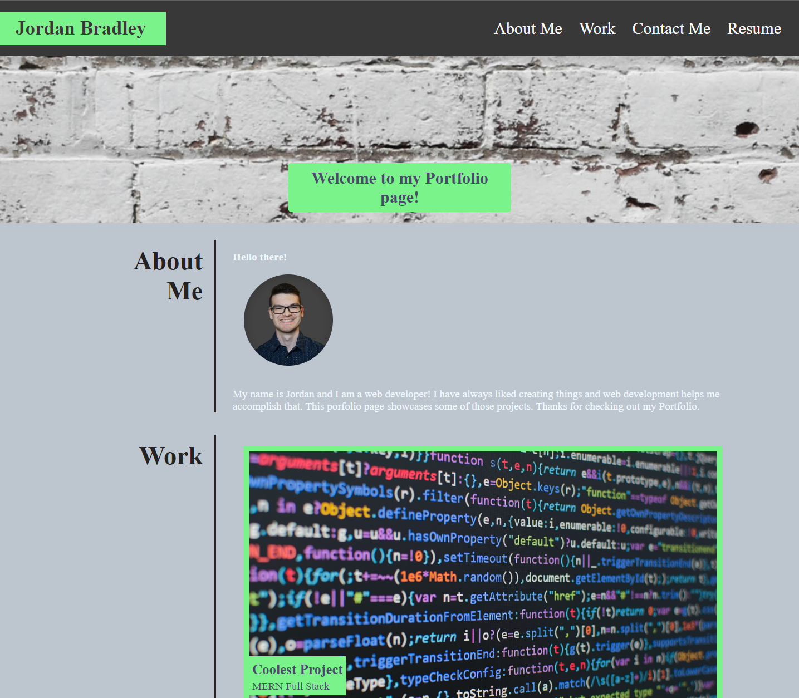

# my-portfolio-website
My Portfolio Page - A page about me, projects and contact info included on page.

# Description
This is a portfolio webpage project, for now the projects showcased are placeholders that will later be replaced with actual working projects. The portfolio page has an about me section with a brief description about me, a profile picture of me. A work section with projects, largest one first and then the rest of the placeholder projects. A contact me section with contact info. Such as Github, LinkedIn and email address.

# Screenshot

Mobile preview

Tablet preview

Desktop preview

# Link to deployed app

https://jordanb366.github.io/my-portfolio-website/
